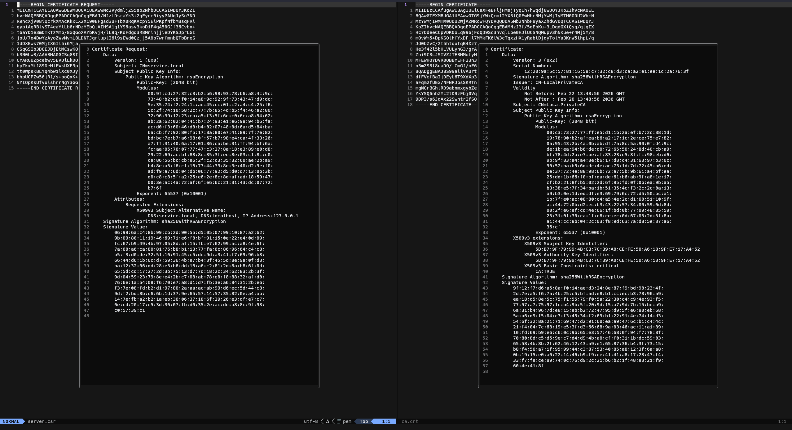

# pemviewer.nvim

A Neovim plugin to inspect PEM certificates and keys. Opens a floating window displaying detailed information about certificates and private keys using OpenSSL.



## Requirements

- Neovim 0.9 or later
- OpenSSL installed on your system

## Installation

### Using LazyVim

```lua
-- In your LazyVim config (~/.config/nvim/lua/plugins/)
{
  "adalbertjnr/pemviewer.nvim",
  keys = {
    { "<leader>pi", "<cmd>PKIInspect<CR>", desc = "Inspect PEM file" },
  },
}
```

### Using packer.nvim

```lua
use("adalbertjnr/pemviewer.nvim")
```

### Using vim-plug

```vim
Plug 'adalbertjnr/pemviewer.nvim'
```

## Usage

1. Open a file containing PEM data (certificate, private key, CSR, etc.)
2. Run the command `:PKIInspect` or press your configured keymap
3. A floating window will appear with the parsed certificate/key information

### Supported PEM Types

- Certificate (X.509)
- Certificate Signing Request (CSR)
- RSA Private Key
- EC Private Key
- PKCS8 Private Key
- Encrypted Private Key
- Trusted Certificate

### Example PEM File

```text
-----BEGIN CERTIFICATE-----
MIIDXTCCAkWgAwIBAgIJAKZ...
-----END CERTIFICATE-----
```

## Configuration

You can customize the plugin by passing options to `setup()`:

```lua
require("pemviewer").setup({
  -- Handlers for different PEM types
  handlers = {
    ["CERTIFICATE"] = { cmd = "openssl x509 -text -noout", label = "Certificate" },
    ["CERTIFICATE REQUEST"] = { cmd = "openssl req -text -noout", label = "CSR" },
    ["RSA PRIVATE KEY"] = { cmd = "openssl rsa -text -noout", label = "RSA Key" },
    ["EC PRIVATE KEY"] = { cmd = "openssl ec -text -noout", label = "EC Key" },
    ["PRIVATE KEY"] = { cmd = "openssl pkey -text -noout", label = "Private Key" },
    ["ENCRYPTED PRIVATE KEY"] = { cmd = "openssl pkey -text -noout", label = "Encrypted Key" },
    ["TRUSTED CERTIFICATE"] = { cmd = "openssl x509 -text -noout", label = "Trusted Cert" },
  },

  -- Window configuration
  window = {
    -- Width as ratio of screen width (0.0 to 1.0)
    width_ratio = 0.3,
    -- Height as ratio of screen height (0.0 to 1.0)
    height_ratio = 0.8,
    -- Border style: "single", "double", "rounded", "solid", "shadow"
    border = "rounded",
    -- Neovim window options
    win_options = {
      relativenumber = true,
    },
  },
})
```

### Default Configuration

```lua
{
  handlers = {
    ["CERTIFICATE"] = { cmd = "openssl x509 -text -noout", label = "Certificate" },
    ["CERTIFICATE REQUEST"] = { cmd = "openssl req -text -noout", label = "Certificate Signing Request" },
    ["RSA PRIVATE KEY"] = { cmd = "openssl rsa -text -noout", label = "RSA Private Key" },
    ["EC PRIVATE KEY"] = { cmd = "openssl ec -text -noout", label = "EC Private Key" },
    ["PRIVATE KEY"] = { cmd = "openssl pkey -text -noout", label = "PKCS8 Private Key" },
    ["ENCRYPTED PRIVATE KEY"] = { cmd = "openssl pkey -text -noout", label = "Encrypted Private Key" },
    ["TRUSTED CERTIFICATE"] = { cmd = "openssl x509 -text -noout", label = "Trusted Certificate" },
  },
  window = {
    width_ratio = 0.3,
    height_ratio = 0.8,
    border = "rounded",
    win_options = {
      relativenumber = true,
    },
  },
}
```

## Commands

- `:PKIInspect` - Inspect the current buffer for PEM content and display in floating window

## Keymaps

The plugin does not set a default keymap. Configure your own in your Neovim config:

```lua
-- Example keymap
vim.keymap.set("n", "<leader>pi", "<cmd>PKIInspect<CR>", { desc = "Inspect PEM file" })
```

Or use LazyVim's keys option:

```lua
{
  "adalbertjnr/pemviewer.nvim",
  keys = {
    { "<leader>pi", "<cmd>PKIInspect<CR>", desc = "Inspect PEM file" },
  },
}
```

## Extending Handlers

You can add support for additional PEM types. By default, your handlers are merged with (extend) the defaults, so you don't lose any built-in handlers.

### Adding Custom Handlers

```lua
require("pemviewer").setup({
  handlers = {
    -- Add your custom handler - defaults are kept
    ["MY_CUSTOM_TYPE"] = {
      cmd = "openssl some-command -text -noout",
      label = "My Custom Type",
    },
  },
})
```

With this, you'll have both the default handlers AND your custom one.

## Window Controls

- Press `<Esc>` or close the window to dismiss
- The window is non-blocking and can be toggled

## License

MIT
